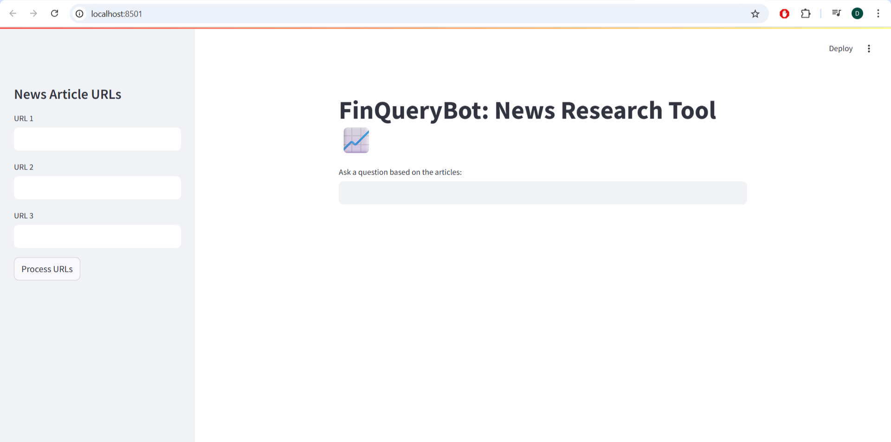

# 📈 FinQueryBot: News Research Tool

**FinQueryBot** is a user-friendly, AI-powered news research tool designed for financial and stock market analysis. Users can input article URLs, process them using LangChain, and intelligently query the content via the Mistral AI LLM.



---

## 🚀 Features

- 🔗 Input and process up to **3 news article URLs**
- 📄 Extract content using LangChain’s `UnstructuredURLLoader`
- ✂️ Automatically **split text into chunks** for better processing
- 🧠 Generate **semantic embeddings** using HuggingFace (`all-MiniLM-L6-v2`)
- 💾 Store and retrieve using **FAISS vector database**
- 🤖 Ask natural language questions and receive intelligent, contextual answers with **source citations**
- 🧠 **FAISS index** saved as a `.pkl` file for fast re-use

---

## 🛠 Installation

### 1. Clone the Repository

```bash
git clone https://github.com/dhruvitsojitra5676/finquerybot.git
cd finquerybot
```

### 2. Install Dependencies

```bash
pip install -r requirements.txt
```

### 3. Set Up Environment Variables

Create a `.env` file in the root directory and add your Mistral API key:

```env
MISTRAL_API_KEY=your_api_key_here
```

> ✅ **Note**: Your `.env` file is included in `.gitignore`, so it won't be uploaded to GitHub.

---

## ▶️ Usage

To launch the app locally:

```bash
streamlit run main.py
```

Then:

- Open your browser at: `http://localhost:8501`
- Enter up to **3 news URLs** in the sidebar
- Click **"Process URLs"**
- Ask a **natural language question**
- View the AI-generated answer and source links

---

## 📁 Project Structure

```
finquerybot/
├── main.py                   # Main Streamlit application
├── requirements.txt          # List of required Python libraries
├── .gitignore                # Ignore .env, __pycache__, .pkl
├── .env                      # Secret API key (NOT pushed to GitHub)
├── faiss_store_mistral.pkl   # FAISS vector store (auto-generated)
└── README.md                 # Project documentation
```

---

## 🧪 Example URLs

Use these sample news links to test:

- [Tata Motors, Mahindra PLI certificates](https://www.moneycontrol.com/news/business/tata-motors-mahindra-gain-certificates-for-production-linked-payouts-11281691.html)
- [Tata Motors launches Punch iCNG](https://www.moneycontrol.com/news/business/tata-motors-launches-punch-icng-price-starts-at-rs-7-1-lakh-11098751.html)
- [Buy Tata Motors - KR Choksey](https://www.moneycontrol.com/news/business/stocks/buy-tata-motors-target-of-rs-743-kr-choksey-11080811.html)

---

## 📦 Dependencies

- `streamlit` – interactive web UI
- `langchain`, `langchain-mistralai` – LLM operations and chaining
- `mistralai` – Mistral AI integration
- `faiss-cpu` – fast vector-based document search
- `unstructured` – news article parsing
- `dotenv` – secure environment variable management
- `sentence-transformers`, `transformers`, `torch` – embeddings and model inference

Install with:

```bash
pip install -r requirements.txt
```

---

## 🔒 Security Tips

- ✅ `.env` and `.pkl` files are excluded from Git using `.gitignore`
- 🚫 Never share or upload your API key publicly
- 🔐 Keep `faiss_store_mistral.pkl` private unless explicitly needed

---

## 👨‍💻 Developer Info

- Built using [LangChain](https://github.com/hwchase17/langchain)
- Powered by [Mistral AI](https://mistral.ai/)
- Vector search via [FAISS](https://github.com/facebookresearch/faiss)

---

## ⭐ Show Support

If you found this project useful:

- ⭐ Star the repository on GitHub
- 🛠️ Fork it for your own use
- 🐛 Report bugs or suggest features in [Issues](https://github.com/dhruvitsojitra5676/finquerybot/issues)

---

## 📬 Contact

Created with ❤️ by Dhruvit Sojitra  
Feel free to connect via GitHub or [open an issue](https://github.com/dhruvitsojitra5676/finquerybot/issues) for feedback!
